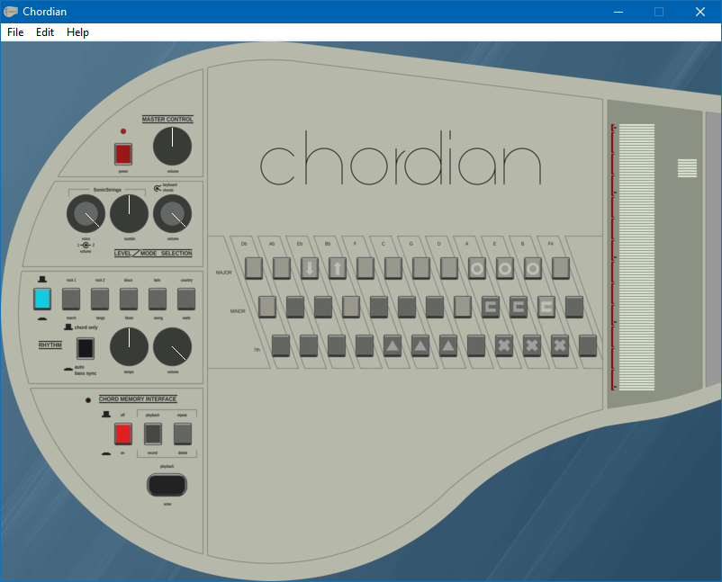

## **Chordian**

Chordian is a virtual instrument emulating the behaviour of a Suzuki Omnichord OM-84.

##

## **Controls:**

Chord keys are by default assigned to the keyboard in the following configuration:

    1  2  3  4  5  6  7  8  9  0  ß  ´
     Q  W  E  R  T  Z  U  I  O  P  Ü  +
      A  S  D  F  G  H  J  K  L  Ö  Ä  #

Please note that this is a standard configuration made for a German ISO keyboard.\
ASCII keyboards will not be able to assign standard small keys for every chord in a consistent manner.

You can reassign chord keys by right-clicking them, then pressing the key that you want them to be.

Chord keys can also be manually clicked, and will stay clicked until being clicked again, or receiving their assigned button being lifted.

##

The strumplate can be played by running across it with the mouse, with a button held.

- Left button: Single note.
- Right button: 3 notes, the one you are pointing at being the lowest, plus the next 2 higher ones (full chord)
- Middle button/wheel click: 3 notes, the one you are pointing at being the lowest, skip one note, play the next, skip one  note, play the next

It can also be played with:

    Esc F1 F2 F3 F4 F5 F6 F7 F8 F9 F10 F11 F12

Please note that F10 will by default be intercepted by Windows, and not play.\
Wine does not have this restriction as of currently.

The buttons currently cannot be reassigned.

##

Sliders can be controlled by left clicking and dragging them.\
Main control is up and down, whereas left and right is a slower, fine adjustment.

You can right-click the sliders to set a value of 0.0 to 1.0.\
The Tempo slider also allows you to enter a desired BPM in the format 120BPM, or
similar.\
The BPM range is from 70.5BPM to 300BPM.

The power button works.

This button, and everything that has not yet been named, cannot be reassigned as of now, and can only be accessed with a mouse.

Please refer to an OM-84 manual for other functions.

## **Troubleshooting:**

Please make sure you have the recommended system requirements if you encounter stuttering or other weird behaviour:
- Windows Vista+ or compatible OS/subsystem required
- 2313 CPU Mark with 1350 Single Thread Rating recommended, 32-bit-support required
- 32MiB of RAM
- Keyboard with 3 key vertical anti-ghosting required, 3 key horizontal anti-ghosting recommended
- Screen resolution of 1024x768 or higher recommended
- Tri-button, or two-button+one-wheel mouse recommended
- Sound chipset from '97 or upward required

##

**> "My antivirus says this is a malicious file"**

This issue has plague PureBasic since at least 4 years now.\
My best guess is that PureBasic compiled things very rigidly, so a lot of the parts will stay the same in the final executable.\
There must have been a malicious program submitted for review, and since then, pretty much every PureBasic-generated executable will be flagged as "potentially malicious" by some vendors.\
There is nothing I can do about it.\
If paranoid, please compile the program yourself.

**> "There is input lag"**

If the conditions of the system requirements are met, here are some tips:

 - Try increasing your sound device's sample and bit depth
 - Try reducing your sound device's sample and bit depth
 - Update your chipset drivers

This program runs volume and wobbly strings frequency updates in a thread that will attempt to run every 1 miliseconds at the most.\
If this program is too much to handle and the thread goes behind schedule, you may encounter blocky audio curves, mistimed rhythms, and a failure to stop the sound from the device.

**> "Why CC0"**

I felt like it, and GPL is a plague.

## **Progress:**

These things are currently implemented:

 - Chord keys
 - Strumplate
 - Volume controls
 - Tempo controls
 - Sustain controls
 - Chord-hold controls
 - Auto bass-sync controls
 - Tuning controls
 - Rhythm section
 - Pattern editor

These things are currently partially implemented:

 - Keyboard mode (Transposing is not implemented)

These things are currently not implemented:

 - Song creation mode

These things may be implemented:

 - Autoplayer
 - Midi input
 - Midi output

