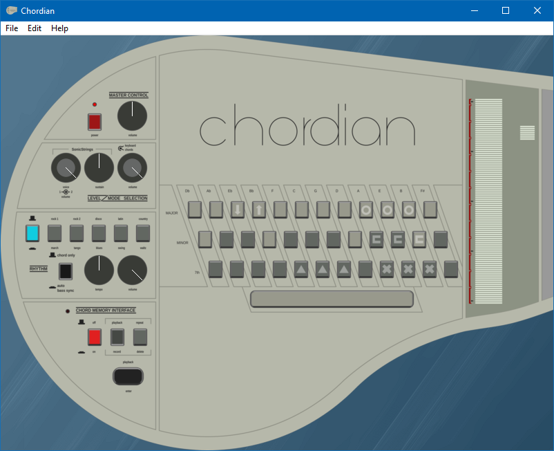
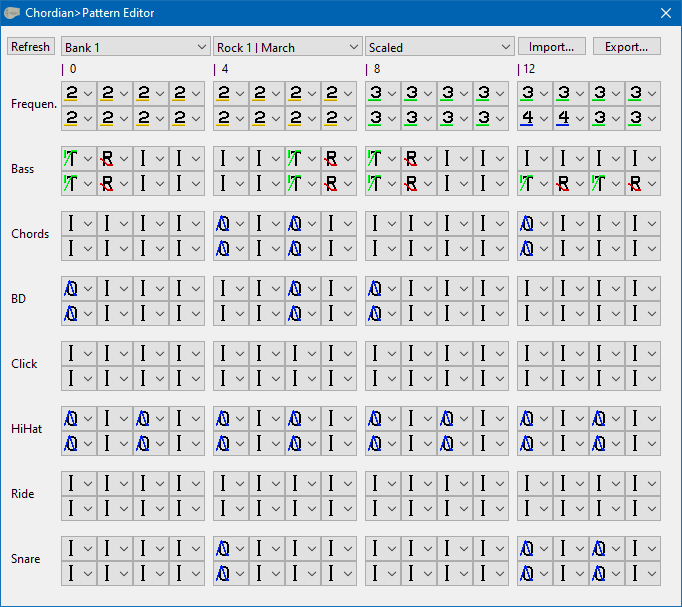
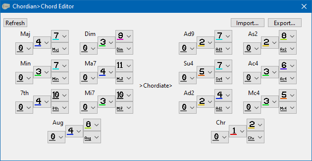

## **Chordian**

Chordian is a virtual instrument emulating the behaviour of a Suzuki Omnichord OM-84.

##

## **Controls:**

Chord keys are by default assigned to the keyboard in the following configuration:

    1  2  3  4  5  6  7  8  9  0  ß  ´
     Q  W  E  R  T  Z  U  I  O  P  Ü  +
      A  S  D  F  G  H  J  K  L  Ö  Ä  #
            '=====SPACE===='

Please note that this is a standard configuration made for a German ISO keyboard.\
ASCII keyboards will not be able to assign standard small keys for every chord in a consistent manner.

You can reassign chord and function keys by right-clicking them, then pressing the key that you want them to be.\
Pressing Escape during that process will revert the key to the standard configuration.\
Clicking anywhere or committing a window size event will not change the button.

Chord and function keys can also be manually clicked.\
Chord keys will stay clicked until being clicked again, or receiving their assigned button being lifted.

The chords you can play are as follows:

- First Row = Major
- Second Row = Minor
- Third Row = 7th

You can combine the keys for more chords:

- Major + Minor = Diminished
- Major + 7th = Major 7th
- Minor + 7th = Minor 7th
- Major + Minor + 7th = Minor 7th

The following combinations are only available in Chordiate Mode:

- Major + Chordiate = Add9
- Minor + Chordiate = Sus4
- 7th + Chordiate = Add2
- Major + Minor + Chordiate = Aug(sus2)
- Major + 7th + Chordiate = Addm4#
- Minor + 7th + Chordiate = Addm4
- Major + Minor + 7th + Chordiate = Chromatic

The Playback|Enter button is bound to LCTRL.

##

The strumplate can be played by running across it with the mouse, with a button held.

By default, the buttons are assigned the following pattern:

- Left button: Single
- Right button: Chord
- Middle button/wheel click: Mirror

The behaviour of the patterns is like follows:

- None: Will not play anything.
- Single: Will play the selected note.
- Double: Plays the selected note, plus the one upward of it.
- Chord: Plays the selected note, plus the two upwards of it. (Full chord)
- Spread: Selected note, +2 upwards, +4 upwards. (Octave with middle note)
- Octave: Selected note, +3 upwards, +6 upwards, +9 upwards. (Multiple Octaves)
- Full: Everything. (Warning: Loud.)
- Reverse: Reverse order Single.
- Mirror: Reverse plus Single.
- Segment: Alternating pattern: In each octave, first note will trigger the last note in said octave, middle note is unaffected.

It can also be played with the numpad.\
From lowest harp note to highest harp note:
        1 2 3 4 5 6 7 8 9 / * - 

These buttons currently cannot be reassigned.

##

Sliders can be controlled by left clicking and dragging them.\
Main control is up and down, whereas left and right is a slower, fine adjustment.

You can right-click the sliders to set a value of 0.0 to 1.0.\
The Tempo slider also allows you to enter a desired BPM in the format 120BPM, or
similar.\
The BPM range is from 70.5BPM to 300BPM.

The power button works.

Please refer to an OM-84 manual for other functions.

## **Pattern Editor:**

The Pattern Editor is a custom feature of Chordian that allows you to define your own rhythm pattern.\
The Blues and Waltz patterns have 24 steps, all other patterns use 32 steps.

You can edit the pattern for specific notes for more variety.\
The Scaled mode aliases 1 and 2 to their respective Omnichord-like frequencies for specific patterns.\
The All mode applies notes as entered directly, as do the note edit modes.\
Ignore is a special internal note that will not play any notes, just drums. 

Overview of the symbols:
- 1: Normal frequency for the bass.
- 2: Low frequency for the bass.
- 3: High frequency for the bass.
- 4: Medium frequency for the bass. (Affected by chord.)
- N: None: Immediately cuts off the sound.
- T: Trigger: Initializes note and causes special behaviour.
- A: Attack: The initial swelling of the sound. Will not do anything in most cases and can NOT be used in place of Trigger.
- D: Decay: The initial ebbing of the sound.
- S: Sustain: Will keep the sound at the current level.
- R: Release: Will let the sound end after some time.
- O: Oneshot: Special variant of Trigger and immediately releases the sound.
- I: Ignore: Does not stand for any command and will be ignored.

## **Chord Editor:**

The Pattern Editor is a custom feature of Chordian that allows you to define your own chords.

The shown values are the offset from the root note in semitones, from 0 to 11.\
Notes are automatically transposed to a value appropriate to the Omnichord, where applicable.

The last selector in each row, to the lower right corner, is the chord behaviour.\
This currently only affects the middle-value bass note (frequency 4), and may be identical with some chords.

## **Chordiate Mode:**

Chordiate Mode is an extension of OM-84 capabilities that can be enabled at will.

It currently does:
- Increase the maximum and minimum ranges for the following parameters:
- - Tuning (-1.0 to 2.0)
- - Sustain (-0.12 to 5.0)
- - Tempo (0.0 to 5.0)
- Increases the keyboard transpose range (-2 to 2)
- Enables the space bar chord button for the second set of chords
- Increases song memory from 51 to 256 chords

Chordiate Mode is saved in the save states.

Disabling Chordiate Mode will not reset values and memory by itself back to regular values.

## **Troubleshooting:**

Please make sure you have the recommended system requirements if you encounter stuttering or other weird behaviour:
- Windows XP+ or compatible OS/subsystem required
- 2313 CPU Mark with 1350 Single Thread Rating recommended, 32-bit-support required
- 48MiB of RAM required, 160MiB of RAM recommended
- Keyboard with 3 key vertical anti-ghosting required, 3 key horizontal anti-ghosting and space bar recommended
- Screen resolution of 1024x768 or higher recommended
- Double-button mouse required, tri-button, or two-button+one-wheel mouse recommended
- Sound chipset from '97 or upward required

##

**> "My antivirus says this is a malicious file"**

This issue has plagued PureBasic since at least 4 years now.\
My best guess is that PureBasic compiled things very rigidly, so a lot of the parts will stay the same in the final executable.\
There must have been a malicious program submitted for review, and since then, pretty much every PureBasic-generated executable will be flagged as "potentially malicious" by some vendors.\
There is nothing I can do about it.\
If paranoid, please compile the program yourself.

**> "There is input lag"**

If the conditions of the system requirements are met, here are some tips:

- Try increasing your sound device's sample rate and bit depth
- Try reducing your sound device's sample rate and bit depth
- Try reducing Chordian's sample rate and increasing its buffer size
- Update your chipset drivers

This program uses a DirectSound stream synthesizer.\
Frequency and pattern updates are called every milisecond.\
If this program is too much to handle and the thread goes behind schedule, you may encounter blocky audio curves, mistimed rhythms, abrupt sound stutter, and a failure to stop the sound from the device.

**> "Why CC0"**

I felt like it, and GPL is a plague.

## **Progress:**

These things are currently implemented:

- Chord keys
- Strumplate
- Volume controls
- Tempo controls
- Sustain controls
- Chord-hold controls
- Auto bass-sync controls
- Tuning controls
- Rhythm section
- Pattern editor
- Keyboard mode
- Chord editor

These things are currently partially implemented:

- Midi output
- Song creation mode (Pending validation)

These things are currently not implemented:

- This list is currently empty

These things may be implemented:

- Autoplayer
- Midi input

